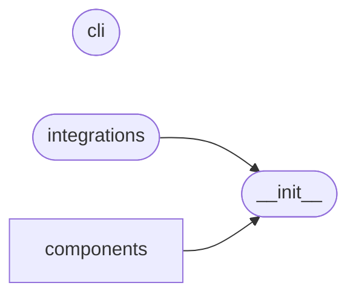

# Code Overview

[_Documentation generated by Documatic_](https://www.documatic.com)

<!---Documatic-section-Codebase Structure Python-start--->
## Codebase Structure Python

The codebase has a single-depth folder structure,
                with 7 code files in total.

<!---Documatic-block-system_architecture-start--->

<!---Documatic-block-system_architecture-end--->

# #
<!---Documatic-section-Codebase Structure Python-end--->

<!---Documatic-section-Important Functions-start--->
## Important Functions

<!---Documatic-block-important_funcs-start--->
<!---Documatic-block-end_user_funcs-start--->
### End User Exposed Functions

* splashgen.__init__.launch
* splashgen.__init__.Component
* splashgen.__init__.MetaTags
<!---Documatic-block-end_user_funcs-end--->
<!---Documatic-block-important_funcs-end--->

# #
<!---Documatic-section-Important Functions-end--->

<!---Documatic-section-File IO-start--->
## File IO

<!---Documatic-block-file_io-start--->
The following files have file read operations

<!---Documatic-block-splashgen.components-start--->

	
<code>splashgen.components</code> (Click to Expand!)

* splashgen.components.SplashSite

<!---Documatic-block-splashgen.components-end--->

The following files have file write operations

<!---Documatic-block-splashgen-start--->

	
<code>splashgen</code> (Click to Expand!)

* splashgen.cli

<!---Documatic-block-splashgen-end--->
<!---Documatic-block-file_io-end--->

# #
<!---Documatic-section-File IO-end--->

<!---Documatic-section-Class Hierarchy-start--->
## Class Hierarchy

<!---Documatic-block-ABC-start--->

	
<code>ABC</code> (Click to Expand!)

* splashgen.__init__.Component

<!---Documatic-block-ABC-end--->

<!---Documatic-block-splashgen.__init__.Component-start--->

	
<code>splashgen.__init__.Component</code> (Click to Expand!)

* splashgen.components.CTAButton.CTAButton
* splashgen.components.SplashSite.SplashSite
* splashgen.components.form.Form
* splashgen.components.form.Input
* splashgen.integrations.MailchimpSignup

<!---Documatic-block-splashgen.__init__.Component-end--->

<!---Documatic-block-splashgen.components.form.Input-start--->

	
<code>splashgen.components.form.Input</code> (Click to Expand!)

* splashgen.components.form.EmailInput
* splashgen.components.form.SelectInput
* splashgen.components.form.TextInput

<!---Documatic-block-splashgen.components.form.Input-end--->

# #
<!---Documatic-section-Class Hierarchy-end--->

[_Documentation generated by Documatic_](https://www.documatic.com)