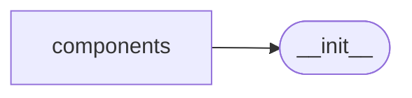

# Splashgen Components

[_Documentation generated by Documatic_](https://www.documatic.com)

<!---Documatic-section-Codebase Structure-start--->
## Codebase Structure

<!---Documatic-block-system_architecture-start--->

<!---Documatic-block-system_architecture-end--->

# #
<!---Documatic-section-Codebase Structure-end--->

<!---Documatic-section-splashgen.components.SplashSite._is_email-start--->
## [splashgen.components.SplashSite._is_email](5-splashgen_components.md#splashgen.components.SplashSite._is_email)

<!---Documatic-section-_is_email-start--->
<!---Documatic-block-splashgen.components.SplashSite._is_email-start--->
<details>
	<summary><code>splashgen.components.SplashSite._is_email</code> code snippet</summary>

```python
def _is_email(url):
    return bool(validate_email(url, check_dns=False, check_blacklist=False, check_smtp=False))
```
</details>
<!---Documatic-block-splashgen.components.SplashSite._is_email-end--->
<!---Documatic-section-_is_email-end--->

# #
<!---Documatic-section-splashgen.components.SplashSite._is_email-end--->

[_Documentation generated by Documatic_](https://www.documatic.com)